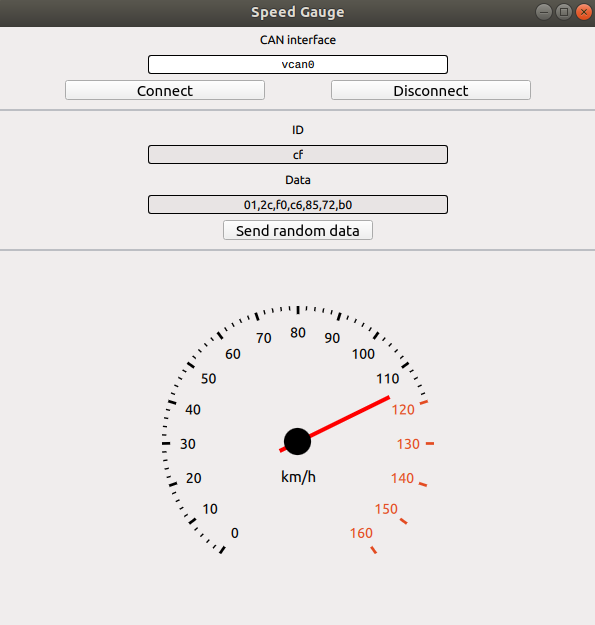

# Index
1. [Introduction](#introduction)
2. [Setup virtual CAN](#setup-virtual-can)
3. [Compilation](#compile)
4. [Run the application](#run-the-aplicattion)

# Introduction

This application receives simulated speed values over a virtual CAN bus using the class [QCanBusDevice](https://doc.qt.io/qt-5/qcanbusdevice.html).

It was developed using,
- Qt 5.13.1
- Ubuntu 18.04.3 LTS
- Qt Creator 4.10.1

# Setup virtual CAN

As described [here](https://elinux.org/Bringing_CAN_interface_up#Virtual_Interfaces), bring up the virtual CAN interface,
```
 $ modprobe vcan
 $ sudo ip link add dev vcan0 type vcan
 $ sudo ip link set up vcan0
```

Run the script [generate_speed_values.sh](generate_speed_values.sh) to generate speed values. For this application, any value with frame id 0x123 is considered as a speed value.

---
**NOTE**

Make sure the [generate_speed_values.sh](generate_speed_values.sh) script is executable,

```
$ chmod +x generate_speed_values.sh
```
---

# Compilation

First, generate the *Makefile*,
```
$ qmake can.pro
```


Then, run *make* to compile the application,
```
$ make
```

This will generate an executable named **can**.

---
**NOTE**

If command 'qmake' is not found, just find the qmake executable and run it using its path,

```
$ sudo find / -executable -name "qmake"
$ /path/to/qmake can.pro
```
---

# Run the application

Once compiled, just run the **can** executable.

```
$ ./can
```
---
**NOTE**

Make sure the **can** application is executable,

```
$ chmod +x can
```
---

The application should look like this image,

